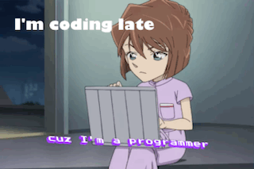

**Hey! I am Ramisha👋 Welcome to my coding universe🌟💚**

I'm passionate about creating user-friendly, aesthetic, and seamless interfaces that enhance people's lives and 
provide exceptional digital experiences. Currently seeking a full-time role in Frontend Development, 
UI/UX Design, Backend Development, or Full-Stack Development to take the next step towards my dream career🌌

```bash
$ unlock Ramisha-s About me
Access granted! 🎉
```


<div align="left">

***🎓 Hunter College CS Alum (Graduated in December 2024) <br>
🤗 Community member of CodePath <br>
☁️ ENFJ <br>
🎮 Listening to music && playing game && editing <br>
❤️ KPOP && Anime && Kdrama && Harry Potter <br>
🗣 Bengali (Native) && Japanese (Fluent/Bilingual) && Korean (Intermediate)***

</div>

```bash
$ unlock Ramisha-s tech stacks
Access granted! 🎉
```

```bash
const ramisha = {
  programmingLanguages: ["Python", "HTML", "CSS", "JavaScript", "C++"],
  frameworksAndLibraries: ["React", "Node.js"],
  tools: ["Postman", "Git", "Figma", "Adobe", "Linux terminal"],
  databases: ["SQL", "MongoDB"],
  concepts: ["RESTful APIs"]
  // And much more in the future because I am an enthusiastic learner!
}
```

```bash
$ unlock Ramisha-s contact information
Access granted! 🎉
```


[🔗 LinkedIn](https://www.linkedin.com/in/ramisha-chowdhury-tech/)  
[✉️ Gmail](mailto:ramisha.c@gmail.com)
